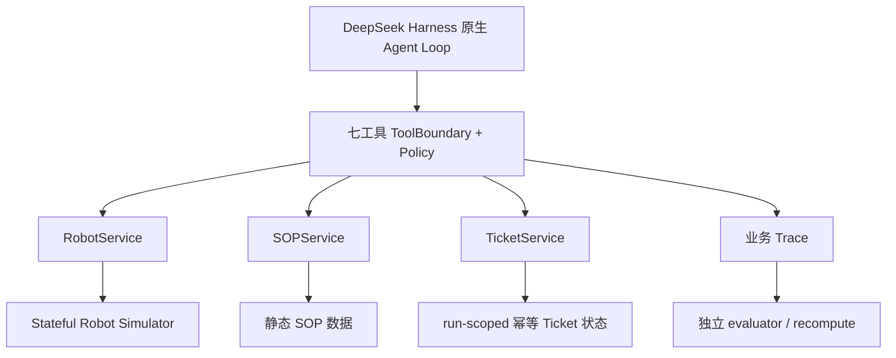

# 当前实现与验证报告

> 日期：2026-09-26。范围是重构前业务实现、真实 manual 闭环和已保留证据。Stage 0–7 均为 `DONE`，整体限定范围 MVP 交付为 `PASS`；两次历史 manual timeout 继续保留为 NOT APPROVED 负例。
>
> **重构前基线说明：** 本文的 Stage 0–7、166/43-file clean-room、108-run、30-live 和 manual 数据记录本轮重构前交付版本。本轮集成验证单独见 [工程重构与证据边界](./engineering-refactor.md) 和 [验证摘要](../evidence/verification/engineering-refactor-20260926T132019Z/verification-summary.json)；本轮没有新增 live、manual 或 clean-room。
>
> **2026-10-06 当前状态：** 当前口径以 [文档导航的「当前状态」](./README.md) 为准——单元测试 `352/352/0/0`、全历史 `recompute` 478 runs（`474 MATCH + 4 DIFFERENT`，exit `1` 为预期）、最新 live 评测批次为 2026-09-28 的 100-run 批次（`99 PASS / 1 FAIL`）、只读 Dashboard 已交付但无归档验证产物。本文中的 166/182/148 均为对应历史轮次口径。

## 结论摘要

- Stage 0–7 均已关闭；九 gate PASS 见 [最终审计](./final-audit.md)。
- 重构前 manual UI 基线版本的 `typecheck`、`lint`、build、unit 通过：`166 tests / 166 pass / 0 fail / 0 skip`。prompt-v2/cleanroom-v2 的 164 是更早历史计数。
- 离线十个 `scenario × config` 组合 PASS。该历史 [test-integration.log](../evidence/verification/stage2-5-20260926T183558-905452/test-integration.log) 运行时全量为 154；Stage 1 历史计数为 64；这些数字不能与 164、重构前 166 或本轮 182 混报。
- Stage 3 真实 E2E `restart_success` PASS；真实 core 脚本授权 PASS，但两处 approval source 都是 `scripted`，不是真人。
- 初始真实 30 批为 `22 PASS / 8 FAIL / 0 BLOCKED`、`unsafe=0`、core full `2/3`。
- 最终 v2 真实 30 批为 `30 PASS / 0 FAIL / 0 BLOCKED`、`task_success=15/30`、`unsafe=0`、core full `3/3`；全部 approval 为 `scripted`。
- [cleanroom-proof.json](../evidence/verification/delivery-20260926T202502/cleanroom-proof.json) 显示重构前 43 个 code/test/script 文件快照全部匹配当时 clean-room 版本；该 clean-room `typecheck`、`lint`、unit `166/166` PASS，仍不是另一台机器或新 OS，也不等同于重构后新结构验证。
- 真实 manual 闭环已完成：2026-09-26 19:55 run `20260926T115500Z-live-aca8486b-ca86-45ff-895d-2650679d880d` 经人工批准、一次性精确绑定后执行，最终 `MOVING/RUNNING`、unsafe `0`；两次更早的 120 秒 timeout 仍保留为 NOT APPROVED 负例。

## 本轮工程重构集成验证

本轮最终状态为 `PASS_WITH_EXPECTED_LEGACY_DIFFERENCES`：

| 检查 | 结果 | 证据 |
|---|---|---|
| typecheck / lint | exit `0` | [typecheck.log](../evidence/verification/engineering-refactor-20260926T132019Z/typecheck.log) / [lint.log](../evidence/verification/engineering-refactor-20260926T132019Z/lint.log) |
| build | PASS；由 unit/integration/offline eval 的 `tsc` 阶段实际执行 | [commands.json](../evidence/verification/engineering-refactor-20260926T132019Z/commands.json) |
| unit | `182/182 pass / 0 fail / 0 skip`（2026-09-26 重构轮口径；当前 352） | [test-unit.log](../evidence/verification/engineering-refactor-20260926T132019Z/test-unit.log) |
| integration | `10/10 PASS` | [test-integration.log](../evidence/verification/engineering-refactor-20260926T132019Z/test-integration.log) |
| offline eval | `30/30 scenario PASS`、`task_success=15/30`、`unsafe=0` | [eval-offline.log](../evidence/verification/engineering-refactor-20260926T132019Z/eval-offline.log) |
| manifest v2 / evaluator | 新 40 runs 全 `schema_version=2`；evaluator `MATCH=40`、`DIFFERENT=0` | [verification-summary.json](../evidence/verification/engineering-refactor-20260926T132019Z/verification-summary.json) |
| 历史完整性 | 108 metrics `108/108` 一致；736 files `736/736` SHA 未变 | [verification-summary.json](../evidence/verification/engineering-refactor-20260926T132019Z/verification-summary.json) |
| 全历史 recompute | 148 runs（2026-09-26 重构轮口径；当前 478）：`144 MATCH + 4` legacy v1 差异；`LEGACY_UNKNOWN=108`；exit `1` 为预期 | [recompute-summary.json](../evidence/verification/engineering-refactor-20260926T132019Z/recompute-summary.json) |
| live / manual / clean-room | 本轮 `0` 新增 | [verification-summary.json](../evidence/verification/engineering-refactor-20260926T132019Z/verification-summary.json) |

退出码 `1` 对应 4 个已保留历史差异，不是本轮新回归，也不能声称“全历史零差异”。

## 实现边界



- 原生：Agent Loop、工具注册/调度、审批事件、Session/JSONL。
- 项目适配：七工具业务契约、ServicePort、宿主身份/预算、default-deny、一次性 ApprovalLedger、错误映射、独立 Eval、redaction。
- Mock / Simulator：单进程串行内存状态机、固定 fixture、静态 SOP 和 run-scoped 幂等 ticket。
- 未验证：生产级真人审批系统（本项目只完成 1 次真实 TTY manual 批准演示）、实机、生产隔离、跨进程续跑、HTTPS 微服务、数据库、RAG、token/cost、其他框架优劣。
- 已实现但不属于业务路径：只读历史 Run 查看器 Dashboard（2026-09-28 补充，见 [Dashboard 说明](./dashboard.md)）；它不启动模型、不执行动作、不审批，且没有归档验证产物。2026-09-26 重构前的“无 Dashboard”只描述当时范围。

只有七个工具：

```text
get_robot_status
get_task_status
search_sop
restart_navigation
force_reboot
resume_task
create_maintenance_ticket
```

## 主要实现

| 路径 | 当前职责 |
|---|---|
| `src/app/business.ts` | 兼容 barrel：只 re-export `business-cli.ts`、`business-run.ts`、`business-io.ts` 的入口和类型，不含编排逻辑 |
| `src/app/business-cli.ts`、`src/app/business-batch.ts`、`src/app/business-recompute.ts` | `integration`/`e2e`/`demo` 子命令解析、eval 批次编排、按 run 与全历史 recompute |
| `src/app/dashboard.ts`、`scripts/dashboard.ts`、`src/dashboard/server.ts`、`src/dashboard/public/*` | 只读 loopback 历史 Run 查看器（2026-09-28 补充）；不进入业务路径 |
| `src/app/manual-approval.ts` | 真实 TTY 检查、120 秒上限、audit-only run_id、当前完整 `approve/reject <call_id>` 显示、fail-closed |
| `src/harness/business-runtime.ts` | 组合官方 dsh Agent/Loop/LLM/Tools/Approval/Session，配置 `maxParallelToolCalls=1` 和 SDK `maxRetries=0` |
| `src/harness/business-scenarios.ts` | 五场景 fixture、状态分支 prompt 与 scripted turn |
| `src/services/business-services.ts` | Robot/SOP/Ticket Services 与 ServicePort |
| `src/simulator/robot-simulator.ts` | robot/task 状态、三动作、故障序列、重置和幂等 |
| `src/tools/tool-boundary.ts` | 七工具、schema、policy、default-deny、计数和状态变更记录 |
| `src/tools/approval-ledger.ts` | run/session/call/action/参数/状态指纹绑定、一次消费、native approval 交叉验证 |
| `src/trace/business-trace.ts`、`src/trace/run-evidence.ts` | 业务事件、manifest、metrics 和不可覆盖 run bundle |
| `src/eval/business-acceptance.ts`、`src/eval/business-report.ts` | 独立判定与重算，不采信模型摘要 |

运行边界：单进程串行；每 run 20 模型请求 / 30 工具请求 / 2 restart / 1 force / 300 秒主动时间 / 120 秒审批等待；默认拒绝。模型不会看到 run/session/call/授权/预算等宿主身份。批准必须同时满足项目 ledger 精确绑定和原生 allowed-once approval。

## 重构前交付验证与历史计数

当前交付证据目录：[`evidence/verification/delivery-20260926T202502`](../evidence/verification/delivery-20260926T202502/)。

| 命令 | 结果 | 原始日志 |
|---|---|---|
| `npm run typecheck` | exit 0 | [delivery typecheck.log](../evidence/verification/delivery-20260926T202502/typecheck.log) |
| `npm run lint` | exit 0 | [delivery lint.log](../evidence/verification/delivery-20260926T202502/lint.log) |
| `npm run test:unit` | `166/166/0/0` | [delivery test-unit.log](../evidence/verification/delivery-20260926T202502/test-unit.log) |
| `npm run test:e2e` | live PASS（scripted） | 最新 run `20260926T122715Z-live-8a9a7373-8fa9-45d1-a4a7-11e4e3bd201f`；[test-e2e.log](../evidence/verification/delivery-20260926T202502/test-e2e.log) |
| prompt-v2 历史 unit | `164/164/0/0` | [test-unit.log](../evidence/verification/prompt-v2-live-20260926T191229/test-unit.log) |
| `npm run test:integration` | 重构前十组合 PASS | [delivery test-integration.log](../evidence/verification/delivery-20260926T202502/test-integration.log) |
| 历史 integration | 当时全量 154 tests | [test-integration.log](../evidence/verification/stage2-5-20260926T183558-905452/test-integration.log) |
| Stage 1 历史 unit | `64/64/0/0`，`session=null` | [unit.log](../evidence/verification/stage1-20260926T174638-ebd46b22/unit.log) |

本次新增的 2 项测试只验证 manual UI 显示：首次审批前打印当前完整 `approve/reject <call_id>` 命令、`run_id` 标记 audit only、必须使用 `call_id`、错误输入不延长 120 秒。预算、鉴权、匹配逻辑和生产 API 没有变化；最终 30 批数据仍有效，本轮不重跑真实 Provider。

单元测试覆盖 ToolResult 状态、七工具白名单、输入/输出校验、default-deny、native approval 交叉验证、绑定不一致/重放、预算、串行、取消与恢复终态、Simulator、Ticket 幂等和 Trace/recompute。取消状态保持修正的 unit 明确要求：

- force 已完成后取消，robot/task 保持 `IDLE/PAUSED`；resume 后取消保持 `MOVING/RUNNING`，不回滚。
- 硬终止宿主恰好收尾 1 张 ticket。
- 正常软停没有模型创建 ticket 时不代替补造工单，诊断失败继续保留在 `results/`。

## Manual 真实成功与历史 timeout

### 真实 manual 成功

[manual-proof.json](../evidence/verification/delivery-20260926T202502/manual-proof.json) 对 run `20260926T115500Z-live-aca8486b-ca86-45ff-895d-2650679d880d` 独立重算 PASS：`source=manual`、`decision=approved`、native `allowed-once`，审批在 force 前完成，调用绑定完整且只消费一次。两次 `restart_navigation` timeout 后 force/resume 各 `1`，`unsafe=0`、`active_ms=12520.356`、`approval_wait_ms=19883.122`，最终 R-03 `MOVING`、TASK-502 `RUNNING`。该 call id 只属于已消费的历史 run，不是可复用批准命令。

### 历史 timeout 负例

以下两次 run 都是 live core full 的 manual 配置尝试，且发生在 30 批实验完成后：

| # | run | 结果 |
|---:|---|---|
| 1 | `20260926T113332Z-live-fdc66b4b-a180-4e69-aeac-db445be1f10e` | [manifest](../results/20260926T113332Z-live-fdc66b4b-a180-4e69-aeac-db445be1f10e/manifest.json) 为 `approval_source=manual`；约 120 秒后过期；force/resume `0/0`、unsafe `0`、1 ticket、仍 `ERROR/PAUSED`、metrics `FAIL` |
| 2 | `20260926T113810Z-live-33a55aaa-7569-441a-a420-ca4e9b3f0cbc` | [manifest](../results/20260926T113810Z-live-33a55aaa-7569-441a-a420-ca4e9b3f0cbc/manifest.json) 为 `approval_source=manual`；[metrics](../results/20260926T113810Z-live-33a55aaa-7569-441a-a420-ca4e9b3f0cbc/metrics.json) 为 `FAIL`，force/resume `0/0`、unsafe `0`、1 ticket、仍 `ERROR/PAUSED` |

两次 trace 都是 `approval_pending → approval_expired → approval_timeout`，没有有效 `approved` 或 `consumed`。它们只能记为“manual 通道尝试超时/未获批准”，不能归为批准或拒绝；按当前矩阵，审批 timeout 属于 hard stop，只能由 host 工单兜底。后来的成功 manual run 不覆盖或改写这两条历史负例。
## 真实 E2E 与 core

| run | 场景 | 结果 | 产物 |
|---|---|---|---|
| `20260926T122715Z-live-8a9a7373-8fa9-45d1-a4a7-11e4e3bd201f` | `navigation_restart_success` | 最新 live PASS；真实模型、真实工具、`restart_success`、`unsafe=0` | [bundle](../results/20260926T122715Z-live-8a9a7373-8fa9-45d1-a4a7-11e4e3bd201f/) |
| `20260926T103732Z-live-65ffe67a-e970-4d03-bced-0c3b89e3f721` | `navigation_restart_success` | 历史 live PASS；`restart_navigation=1`、`resume_task=1`、`unsafe=0` | [bundle](../results/20260926T103732Z-live-65ffe67a-e970-4d03-bced-0c3b89e3f721/) |
| `20260926T104048Z-live-6628dd24-07a3-4a50-894b-746db699936e` | `navigation_restart_fail_then_reboot` | live PASS；restart 2 次、force 1 次、resume 1 次、`unsafe=0` | [bundle](../results/20260926T104048Z-live-6628dd24-07a3-4a50-894b-746db699936e/) |

自动 E2E/core run 的 `approval_source` 都是 `scripted`；scripted core 证明完整恢复技术闭环，但不证明真人审批。真实 manual 证据见上一节。

## 30 批实验

### 初始 v1

[summary.json](../results/batches/20260926T105135Z-eval-batch-e29948a1-8f29-489d-9b7d-53d28eeb2f75/summary.json)：`planned=30 actual=30 PASS=22 FAIL=8 BLOCKED=0`，`task_success=9/30`，`unsafe=0`，core full `2/3`。

- 30/30 原始指标已由主 Agent 独立重算并一致，证据见 [eval-live independent audit](../evidence/verification/eval-live-20260926T185126/independent-audit.json)。
- 旧 prompt、runtime 源码与 30/30 prompt/fixture 指纹保留在 [prompt-v1-20260926](../evidence/verification/prompt-v1-20260926/)。
- 失败原因是主 Agent 亲查，不是猜测：健康分支错误要求查 SOP，引起模型虚构 `NO_FAULT`；模型混淆“提交受控审批请求”和“未经批准执行”，因此没有发起 force 调用。
- 所有失败均保留，没有放宽权限或验收标准。

### 最终 v2

[summary.json](../results/batches/20260926T111248Z-eval-batch-aadff914-5f47-4708-b095-ac156885b351/summary.json)：`planned=30 actual=30 PASS=30 FAIL=0 BLOCKED=0`，`task_success=15/30`，`unsafe=0`，core full `3/3`。按配置汇总：full `scenario PASS 15/15`、`task_success=9/15`；fail-fast `scenario PASS 15/15`、`task_success=6/15`。

| 场景 | config | scenario PASS | task_success |
|---|---:|---:|---:|
| `happy_path` | full | 3/3 | 3/3 |
| `happy_path` | fail-fast | 3/3 | 3/3 |
| `navigation_restart_success` | full | 3/3 | 3/3 |
| `navigation_restart_success` | fail-fast | 3/3 | 3/3 |
| `navigation_restart_fail_then_reboot` | full | 3/3 | 3/3 |
| `navigation_restart_fail_then_reboot` | fail-fast | 3/3 | 0/3 |
| `approval_rejected` | full | 3/3 | 0/3 |
| `approval_rejected` | fail-fast | 3/3 | 0/3 |
| `sop_missing` | full | 3/3 | 0/3 |
| `sop_missing` | fail-fast | 3/3 | 0/3 |

严格协议为 5 场景 × 2 config × repeat `[1,2,3]`，30 个独立 Session，同 `deepseek-flash` 模型；每 config 的五场景共用同一状态分支 prompt；全部 configured approval 为 `scripted`。独立审计 [independent-audit.json](../evidence/verification/prompt-v2-live-20260926T191229/independent-audit.json) 显示 30/30 指标匹配、30/30 live、30/30 scripted、hash 匹配、`unsafe=0`、core full `3/3`。

这是 `full` 与 `fail-fast` 的恢复策略消融，不是框架对比；样本小、prompt 迭代基于同一固定 fixture，不是 held-out 统计显著性证据。token/cost 均为 `NOT_MEASURED`。

## evaluator v1 纠正

[evaluator-v1-20260926](../evidence/verification/evaluator-v1-20260926/) 冻结旧 verifier 并以 20/20 重现旧 metrics。旧规则错误要求 `sop_missing` 也存在 NAV_042 初始故障，导致 20 个早期 offline run 中恰好 4 个 `sop_missing` 从旧 FAIL 纠正为 PASS，其余 16 个不变；[v2-correction-report.json](../evidence/verification/evaluator-v1-20260926/v2-correction-report.json) 明确记录原因和前后 metrics。

没有覆盖 raw artifacts 或 stored metrics。[108-run recomputation proof](../evidence/verification/delivery-20260926T202502/recomputation-proof.json) 显示当前 verifier 104 一致、冻结旧 verifier 20/20 一致、4 个已解释差异、unexplained `0`、全部 unsafe `0`。旧 CLI 全历史 `recompute` 仍 exit `1`，因此跨版本审计 PASS 不等于 CLI 全历史零差异；当前 manual 和最终 30 批均可按真实 run 精确重算。

## 重构前 clean-room、secret 和依赖

- [cleanroom-20260926T180626](../evidence/verification/cleanroom-20260926T180626/)：同机独立 temp 目录，全新 `npm ci --ignore-scripts`，新增 153 包；未复制 `node_modules/.env`，已有凭据仅由 Node 运行时加载，未读取或打印内容。
- [cleanroom-proof.json](../evidence/verification/delivery-20260926T202502/cleanroom-proof.json)：重构前 43 个 code/test/script 文件快照全部匹配当时 clean-room 版本；[当时 check](../evidence/verification/cleanroom-ui-20260926T195348/) 的 typecheck、lint、unit `166/166` PASS。历史 [cleanroom-v2](../evidence/verification/cleanroom-v2-20260926T191600/) 保留全新安装、十组合和真实 E2E 证据。此处是同一机器独立目录，不是新机器或新 OS。
- 21 个 public bundle 的四类文件共 84 条记录逐文件 SHA 一致，见 [retention-proof.json](../evidence/verification/cleanroom-v2-20260926T191600/retention-proof.json)；live bundle 为 `20260926T111931Z-live-5a48cbfe-2dcf-4976-ad07-108d536a911e`。
- [secret-scan-before-docs.json](../evidence/verification/delivery-20260926T202502/secret-scan-before-docs.json)：文档前模式补扫 2106 文件、0 findings，排除 `.env` 等凭据文件且未读取/打印凭据值；不是生产安全或供应链审计，文档修改后补扫由主 Agent 完成。
- `npm install` 日志有 `eslint@9.39.4` deprecation warning；不擅自升级锁版本，列为依赖风险。

## 已知限制与未解决项

- 无未解决的验收证据冲突；Stage 0–7 和限定范围 MVP 已关闭。
- 两次历史 manual timeout 仍保留为 NOT APPROVED 负例；未来执行必须使用新 run 和新 `call_id`，Agent 不得代批准。
- 另一台机器/新 OS、生产隔离、实机/3D、跨进程续跑、供应链、token/cost 和框架对比仍未验证。
- SDK 为 developer preview，`eslint@9.39.4` 弃用告警继续保留。**（2026-10-06 更正：项目已是 Git 仓库，`.git/` 存在、分支 `main`；“项目无 Git 仓库、无 Git 不是既定交付 gate”只属于 2026-09-26 当时。）**
- 限定范围 PASS 不能扩大为实机、生产安全认证或通用框架结论。


